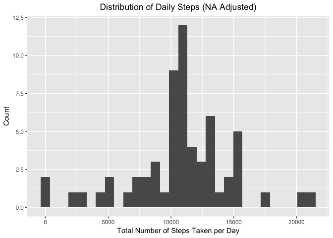

# Reproducible Research: Peer Assessment 1
Yang Zhang  
7/14/2017  


## Loading and Preprocessing Data 

The data are saved in the `activit.csv` file, which is located under the same directory of this markdown file. To import the data into this R session, we are going to use the `read_csv` function from the `readr` package. 


```r
library(tidyverse)
library(lubridate)

rawData <- read_csv("./activity.zip",
                    col_type = cols(steps = col_integer(),
                                    date = col_date(format = ""),
                                    interval = col_integer()
                                    )
                    )
```

The imported data is already stored in a tidy way. The only thing that needs to be changed is the "interval" column. We will need to convert the data from "hhmm" numbers to integers representing the minutes.


```r
data1 <- rawData %>%
  select(date, interval, steps) %>%
  mutate(interval = interval %/% 100 * 60 + interval %% 100)
```


## Calculate The Mean Total Number of Steps Taken per Day

Since the data were recorded at each 5 minute interval, we will need to calculate the total number of steps taken per day first. This can be done by the `group_by` and `summarise` functions in the `dplyr` package. 


```r
dailySum1 <- data1 %>%
  group_by(date) %>%
  summarise(steps = sum(steps, na.rm = TRUE))
head(dailySum1, 5)
```

```
## # A tibble: 5 x 2
##         date steps
##       <date> <int>
## 1 2012-10-01     0
## 2 2012-10-02   126
## 3 2012-10-03 11352
## 4 2012-10-04 12116
## 5 2012-10-05 13294
```

Here is a histogram for the distribution of the the daily steps. 


```r
ggplot(dailySum1, aes(x = steps)) +
  geom_histogram(bins = 30) + 
  labs(
    title = "Distribution of Daily Steps (NA converts to 0)",
    x = "Total Number of Steps Taken per Day",
    y = "Count"
  ) +
  theme(plot.title = element_text(hjust = 0.5))
```

<!-- -->

We can use the `summary` function to get the mean and median values of total daily steps. 


```r
dailySum1Stat <- summary(dailySum1$steps)
dailySum1Stat
```

```
##    Min. 1st Qu.  Median    Mean 3rd Qu.    Max. 
##       0    6778   10400    9354   12810   21190
```

* Mean: 9,354
* Median: 10,400


## Calculate Daily Activity Pattern

To calculate the daily activity pattern by time interval, the data frame will need to be regrouped by interval and averaged across the dates.


```r
intervalMean1 <- data1 %>%
  group_by(interval) %>%
  summarise(steps = mean(steps, na.rm = TRUE))
head(intervalMean1, 5)
```

```
## # A tibble: 5 x 2
##   interval     steps
##      <dbl>     <dbl>
## 1        0 1.7169811
## 2        5 0.3396226
## 3       10 0.1320755
## 4       15 0.1509434
## 5       20 0.0754717
```

Here is a line plot showing how the average interval steps vary across the day.


```r
ggplot(intervalMean1, aes(x = interval, y = steps)) +
  geom_line() + 
  labs(
    title = "Daily Activiy Pattern (Ignore NA)",
    x = "Interval (minutes)",
    y = "Steps"
  ) +
  theme(plot.title = element_text(hjust = 0.5))
```

<!-- -->


```r
maxInterval <- intervalMean1 %>%
  filter(steps == max(steps)) %>%
  .$interval
```

As we can see, the interval that contains the maximum average number of steps is **515**.


## Imputing Missing Values


```r
countNA <- sum(is.na(rawData$steps))
countNA
```

```
## [1] 2304
```

In the previous sections, the NA values are treated as 0 or simply ignored when we were calucalting the total and average values. However, since there are **2304** intervals with NA, we will need to develop another approach to evaluate the missing values. 

One strategy would be **replacing each NA value with the average number of steps taken in the same interval across the days**. 


```r
data2 <- data1
naIndex <- which(is.na(data1$steps))
data2$steps[naIndex] <- data2[naIndex,] %>%
  select(interval, steps) %>%
  left_join(intervalMean1, by = "interval") %>%
  .$steps.y
head(data2, 5)
```

```
## # A tibble: 5 x 3
##         date interval     steps
##       <date>    <dbl>     <dbl>
## 1 2012-10-01        0 1.7169811
## 2 2012-10-01        5 0.3396226
## 3 2012-10-01       10 0.1320755
## 4 2012-10-01       15 0.1509434
## 5 2012-10-01       20 0.0754717
```

With the missing values adjusted, we can create a new histogram to show the distribution of daily total steps.


```r
dailySum2 <- data2 %>%
  group_by(date) %>%
  summarise(steps = sum(steps))

ggplot(dailySum2, aes(x = steps)) +
  geom_histogram(bins = 30) + 
  labs(
    title = "Distribution of Daily Steps (NA Adjusted)",
    x = "Total Number of Steps Taken per Day",
    y = "Count"
  ) +
  theme(plot.title = element_text(hjust = 0.5))
```

<!-- -->

```r
dailySum2Stat <- summary(dailySum2$steps)
dailySum2Stat
```

```
##    Min. 1st Qu.  Median    Mean 3rd Qu.    Max. 
##      41    9819   10770   10770   12810   21190
```

Now the mean and mediam total steps taken per day become:

* Mean: 10,770
* Median: 10,770


## Activity Patterns Between Weekdays and Weekends

To compare the acavity parterns between weekdays and weekends, we will need to break the data into two groups, weekday and weekend, first. This can be done by adding a new column, `day_of_week`, into the data frame and using the `wday` function from the `lubridate` package.


```r
data2 <- data2 %>%
  mutate(
    day_of_week = as.factor(ifelse(
      wday(date) == 1 | wday(date) == 7, 
      "weekend", 
      "weekday"
    ))
  ) %>%
  select(date, day_of_week, interval, steps)
head(data2, 5)
```

```
## # A tibble: 5 x 4
##         date day_of_week interval     steps
##       <date>      <fctr>    <dbl>     <dbl>
## 1 2012-10-01     weekday        0 1.7169811
## 2 2012-10-01     weekday        5 0.3396226
## 3 2012-10-01     weekday       10 0.1320755
## 4 2012-10-01     weekday       15 0.1509434
## 5 2012-10-01     weekday       20 0.0754717
```

Using the similar approach, we can then calulate the daily activities for weekday and weekend and compare their patterns side-by-side as below.


```r
intervalMean2 <- data2 %>%
  group_by(day_of_week, interval) %>%
  summarise(steps = mean(steps))

ggplot(intervalMean2, aes(x = interval, y = steps, color = day_of_week)) + 
  geom_line() + 
  facet_wrap(~day_of_week) + 
  labs(
    title = "Daily Activiy Pattern (Weekday vs. Weekend)",
    x = "Interval (Minutes)",
    y = "Steps"
  ) +
  theme(plot.title = element_text(hjust = 0.5),
        legend.position = "none")
```

<!-- -->

As we can see, the plots show different activity patterns for weekday and weekend. On weekdays, the number of steps starts to increase around 5:00 am. The pattern shows four apparent peaks during the day, which happens around 9:00 am, 12:00 pm, 4:30 pm, and 8:00 pm. The maximum interval appears aound 9:00 am, and its value is significantly larger than other intervals. The weekend steps start to pick up around 8:00 am. The pattern has similar peak intervals at the same time, but their values are not very different from each other.

